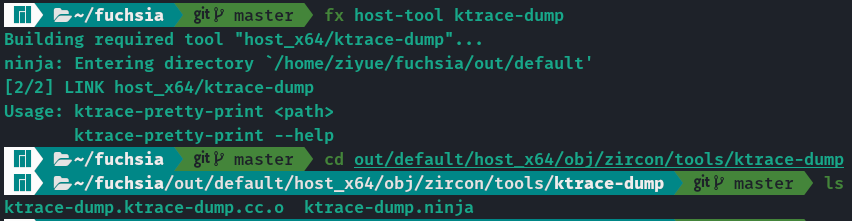

# `ktrace-dump` utility is not built

`ktrace-dump` is a small utility that converts Fuchsia's ktrace record into human-readable format.

## Reproduce

Follow the [Kernel Tracing](https://fuchsia.dev/fuchsia-src/development/tracing/advanced/recording-a-kernel-trace?hl=en) tutorial, `ktrace-dump` utility is not build by default.

## Solution

Use `fx host-tool` command.

```sh
$ cd path/to/fuchsia
#---------------#
# build fuchsia #
#---------------#

# This command builds ktrace-dump automatically
$ fx host-tool ktrace-dump
```


