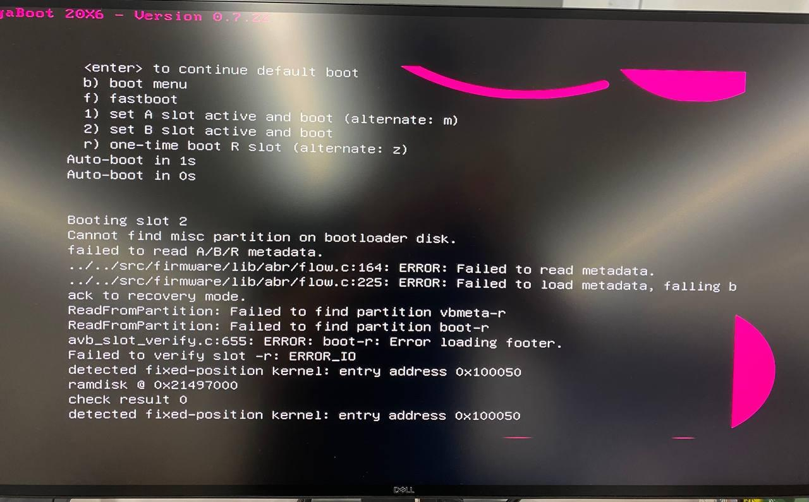

# Missing Partition when Booting on NUC

Missing parition when booting on Intel NUC 9 Extreme Kit.


## Reproduce

- Host OS: Linux x86_64
  - Distro: Manjaro KDE Plasma
- Host CPU: i7-10700
- Target: Intel NUC 9 Extreme Kit

Follow [Install Fuchsia on a NUC](https://fuchsia.dev/fuchsia-src/development/hardware/intel_nuc).

```bash
$ fx set core.x64 --release
# or:
# fx set workstation.x64
# fx set core.x64
$ fx build
$ fx mkzedboot /dev/sda
# Plug USB media to target and power on.  
```

It ends with:

